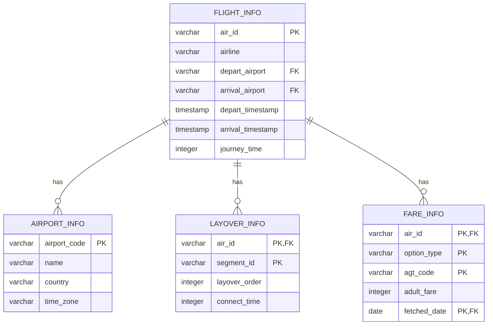

# 1. 데이터 파이프라인 아키텍처


| 컴포넌트           | 설명                                                                 |
|------------------|----------------------------------------------------------------------|
| **Airflow**       | 전체 데이터 파이프라인 스케줄링 및 모니터링 관리                          |
| **Redis**         | 메시지 큐 역할 수행<br>- 크롤링 파라미터 및 프록시 정보 전달<br>- 크롤링 완료 상태 확인 |
| **크롤러 스웜**     | GCP VM 3대에 크롤링 컨테이너 6개 배포<br>- 병렬 수집 후 JSON 파일을 GCS 업로드   |
| **Spark 클러스터** | GCS에 저장된 JSON 데이터를 스트리밍으로 처리<br>- 데이터베이스(Postgres)에 적재 |
| **Postgres**      | 2TB 용량의 데이터베이스<br>- 처리된 항공권 데이터 저장                     |


# 2. 크롤러 파이프라인


Multi Thread를 활용하여 병렬 request -> 응답값을 GCS로 업로드 (추후 스파크 클러스터가 파싱 및 적재) 


# 3. 데이터베이스 스키마

본 문서는 네이버 항공권 데이터베이스의 구조에 대한 문서입니다.



## 테이블 구조

### AIRPORT_INFO 테이블

| 컬럼명 | 데이터 타입 | 설명 | 예시 |
|--------|------------|------|------|
| airport_code | varchar(10) | 공항 코드 (PK) | ICN |
| name | varchar(100) | 공항 이름 | 인천국제공항 |
| country | varchar(100) | 국가 | 대한민국 |
| time_zone | varchar(100) | 시간대 | Asia/Seoul |

### FLIGHT_INFO 테이블

| 컬럼명 | 데이터 타입 | 설명 | 예시 |
|--------|------------|------|------|
| air_id | varchar(100) | 항공권 ID (PK) | 20240927ICNPUSKE1827 |
| airline | varchar(30) | 항공사 | 대한항공 |
| depart_airport | varchar(10) | 출발 공항 (FK) | ICN |
| arrival_airport | varchar(10) | 도착 공항 (FK) | PUS |
| depart_timestamp | timestamp | 출발 시간 | 2024-09-27 18:27:00 |
| arrival_timestamp | timestamp | 도착 시간 | 2024-09-27 19:30:00 |
| journey_time | integer | 비행 시간 (분) | 63 |
| is_layover | boolean | 경유여부 | True/False |

### FARE_INFO 테이블

| 컬럼명 | 데이터 타입 | 설명 | 예시 |
|--------|------------|------|------|
| air_id | varchar(100) | 항공권 ID (PK, FK) | 20240927ICNPUSKE1827 |
| option_type | varchar(50) | 구매 유형 (PK) | 일반석/할인석/비즈니스석 |
| agt_code | varchar(50) | 여행사 코드 (PK) | INT005 |
| adult_fare | integer | 성인 요금 | 210800 |
| fetched_date | date | 수집 날짜 (PK) | 2024-08-20 |
| fare_class | character | 운임 클래스 | n, K, L ...|

### LAYOVER_INFO 테이블

| 컬럼명 | 데이터 타입 | 설명 | 예시 |
|--------|------------|------|------|
| air_id | varchar(100) | 항공권 ID (PK, FK) | 20240927ICNPUSKE1827 |
| segment_id | varchar(50) | 구간 ID (PK) | SEG001 |
| layover_order | integer | 경유 순서 | 1 |
| connect_time | integer | 연결 시간 (분) | 120 |

## 참고 사항
- 공항 정보는 airport_info 테이블에서 공항 코드를 key로 찾을 수 있습니다.
- 출발 시간과 도착 시간은 UTC (세계 협정시) 기준으로 저장되어 있습니다. 필요시 airport_info 테이블의 time_zone에 맞춰 공항 위치에 따른 시간대 변환이 가능합니다.
- 경유 항공권의 경우 해당 항공권을 구성하는 편도 항공권들의 id와 경유 순서, 환승 시간이 layover_info 테이블에 저장되어 있습니다. 필요시 추가 분석이 가능합니다.

## 테이블 생성 SQL 쿼리

```sql
-- 1) airport_info
CREATE TABLE airport_info (
  airport_code   VARCHAR(10)    NOT NULL,
  name           VARCHAR(30),
  country        VARCHAR(30),
  time_zone      VARCHAR(20),
  CONSTRAINT airport_info_pkey PRIMARY KEY (airport_code)
);

-- 2) flight_info
CREATE TABLE flight_info (
  air_id            VARCHAR(100)  NOT NULL,
  airline           VARCHAR(30),
  depart_airport    VARCHAR(10),
  arrival_airport   VARCHAR(10),
  depart_timestamp  TIMESTAMPTZ,
  arrival_timestamp TIMESTAMPTZ,
  journey_time      INTEGER,
  is_layover        BOOLEAN,
  CONSTRAINT flight_info_pkey PRIMARY KEY (air_id),
  CONSTRAINT flight_info_depart_airport_fkey FOREIGN KEY (depart_airport) REFERENCES airport_info(airport_code),
  CONSTRAINT flight_info_arrival_airport_fkey FOREIGN KEY (arrival_airport) REFERENCES airport_info(airport_code)
);

-- 3) fare_info  
CREATE TABLE fare_info (
  air_id       VARCHAR(100)    NOT NULL,
  seat_class   VARCHAR(50)     NOT NULL,
  agt_code     VARCHAR(50)     NOT NULL,
  adult_fare   INTEGER,
  fetched_date DATE            NOT NULL,
  fare_class   CHAR(1)         NOT NULL,
  batch_id     BIGINT          NOT NULL,
  CONSTRAINT fare_info_pkey PRIMARY KEY (air_id, fetched_date, seat_class, fare_class, agt_code),
  CONSTRAINT fare_info_air_id_fkey FOREIGN KEY (air_id) REFERENCES flight_info(air_id) ON DELETE CASCADE
);

-- 4) layover_info
CREATE TABLE layover_info (
  air_id        VARCHAR(100)  NOT NULL,
  segment_id    VARCHAR(50)   NOT NULL,
  layover_order INTEGER       NOT NULL,
  connect_time  INTEGER,
  CONSTRAINT layover_info_pkey PRIMARY KEY (air_id, segment_id, layover_order),
  CONSTRAINT layover_info_air_id_fkey FOREIGN KEY (air_id)
    REFERENCES flight_info(air_id) ON DELETE CASCADE
);
```
## 인덱싱
```sql
-- 배치 ID용 시퀀스 (이미 있다면 생략 가능)
CREATE SEQUENCE IF NOT EXISTS before_fare_info_batch_id_seq;
-- 비행편 출발/도착 공항 조합 조회 인덱스
CREATE INDEX idx_airports_flight_info ON flight_info (depart_airport, arrival_airport);
-- 배치 ID 및 수집일 인덱스
CREATE INDEX idx_before_fare_info_batch_id ON fare_info (batch_id);
CREATE INDEX idx_fare_info_fetched_date ON fare_info (fetched_date);
```